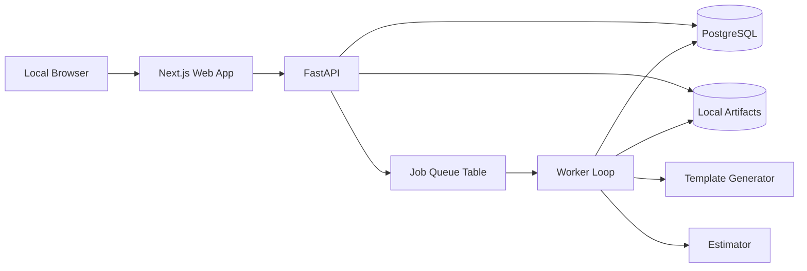

# Hybrid Quantum Workload Navigator

## Local MVP blueprint

This document turns the PRD, user guide, and architecture note into a buildable
local-first implementation plan.

## Build goal

Build a local MVP that can answer these questions in one session:

1. Is this workload a classical-only, education-only, hybrid prototype now, or
   fault-tolerant candidate later use case?
2. Which parts of the workflow stay classical and which narrow subproblem is a
   quantum candidate?
3. What artifact package can the user export today for follow-up discussion?

The MVP is simulation-first and does not depend on direct QPU access.

## Product slice for V1

Build only these product surfaces:

1. `Dashboard`
   Shows recent sessions and templates.
2. `Guided intake`
   Captures workload details, baseline, bottleneck, constraints, and audience.
3. `Fit report`
   Produces one disposition plus rationale, assumptions, and confidence.
4. `Hybrid canvas`
   Shows the classical lane, quantum candidate lane, and verification lane.
5. `Prototype builder`
   Generates one of three starter artifacts:
   chemistry notebook, optimization notebook, or architecture summary.
6. `Future-state estimate`
   Captures later-stage fault-tolerant assumptions and lightweight resource
   estimate metadata.
7. `Exports`
   Produces a markdown brief, JSON session bundle, and generated notebook files.

Defer auth, collaboration, real cloud storage, enterprise telemetry, and
production-scale simulation to later phases.

## Technical decisions

Use a modular monolith with one frontend and one backend codebase:

- Frontend: `Next.js` + `TypeScript`
- API: `FastAPI`
- Worker logic: Python package inside the API repo, invoked via background jobs
- Database: `PostgreSQL`
- Async model: Postgres-backed `jobs` table with worker polling in V1
- File storage: local filesystem under `./data/artifacts`
- Notebook generation: template-based from Python/Jinja templates
- LLM layer: excluded from V1 runtime, leave integration points in place

This keeps local development simple while preserving a clean path to Cloud Run
plus Cloud SQL later.

## Repository structure

```text
quantum-explorer-1/
  apps/
    web/
      app/
      components/
      lib/
      styles/
      package.json
      tsconfig.json
    api/
      app/
        main.py
        api/
        core/
        models/
        schemas/
        services/
        workers/
        templates/
      tests/
      pyproject.toml
  docs/
    local-mvp-blueprint.md
    api-and-data-model.md
    fit-assessment-rubric.md
    build-plan.md
  data/
    artifacts/
  docker/
    postgres-init/
  docker-compose.yml
  .env.example
  README.md
```

## Module responsibilities

### `apps/web`

- Owns all user flows and stateful editing UX
- Calls backend APIs only
- Does not embed suitability logic
- Supports `Executive` and `Builder` display modes

### `apps/api/app/services/intake.py`

- Normalizes raw intake fields
- Computes completeness
- Emits follow-up prompts for missing inputs

### `apps/api/app/services/assessment.py`

- Applies deterministic scoring rubric
- Emits disposition, confidence, rationale, and assumptions

### `apps/api/app/services/workflow_graph.py`

- Builds editable workflow nodes and edges
- Splits workflow into classical, quantum candidate, and verification stages

### `apps/api/app/services/prototype_generator.py`

- Chooses template by problem family and disposition
- Fills notebook and brief templates with structured inputs

### `apps/api/app/services/resource_estimator.py`

- Produces lightweight future-state estimate metadata
- Does not claim production feasibility

### `apps/api/app/services/exporter.py`

- Bundles markdown summary, JSON export, and artifact references

### `apps/api/app/workers`

- Executes long-running generation jobs
- Updates `jobs` table and artifact status

## Local runtime architecture



## Local development approach

### Frontend

- App Router
- Server actions are optional; prefer plain API calls for portability
- Keep all server data fetching behind `lib/api-client.ts`

### Backend

- FastAPI routers under `api/v1`
- SQLAlchemy models
- Pydantic schemas
- Alembic migrations
- Pytest for service and endpoint tests

### Persistence

- Postgres as the source of truth
- JSONB for flexible scenario metadata and assumptions
- Filesystem for generated notebooks, markdown, diagrams, and JSON bundles

## UI screen checklist

### 1. Dashboard

- Session list
- Create new session
- Clone session
- Filter by disposition

### 2. Guided intake

- Session metadata
- Audience mode
- Business objective
- Current baseline
- Bottleneck
- Problem family
- Representation
- Validation needs
- Time horizon
- Success metric
- Completeness indicator

### 3. Fit report

- Disposition card
- Confidence band
- Why this outcome
- Assumptions
- What would change this recommendation
- Next recommended action

### 4. Hybrid canvas

- Three swimlanes:
  classical, quantum candidate, verification
- Editable nodes
- Readiness label per node
- Notes per node

### 5. Prototype builder

- Template selector
- Problem-family-specific parameters
- Preview panel
- Generate action
- Job status

### 6. Future-state estimate

- Later-path summary
- Assumption table
- Resource-estimation placeholders
- Caveat banner

### 7. Exports

- Export bundle checklist
- Markdown preview
- Download links

## What is enough to start coding

You can start implementation once these four documents exist and are stable:

1. this blueprint
2. API and data model
3. fit-assessment rubric
4. milestone build plan

The PRD and user guide are sufficient product inputs for a local MVP once those
engineering docs are in place.
